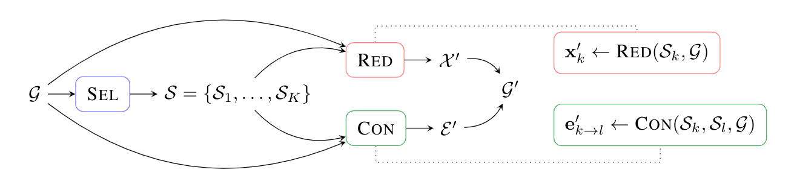

# Select, Reduce, Connect



This repository contains the code used for the experiments of:

**"Understanding Pooling in Graph Neural Networks"**   
D. Grattarola, D. Zambon, F. M. Bianchi, C. Alippi  
https://arxiv.org/abs/2110.05292


# Setup

The dependencies of the project are listed in requirements.txt. You can install them with: 

```bash
pip install -r requirements.txt
```

# Running experiments

The code to run our experiments is in the following folders: 

- `autoencoder/`
- `spectral_similarity/`
- `graph_classification/`

Each folder has a script called `run_all.sh` that will reproduce the results reported in the paper. 

To generate the plots and tables from the paper, you can use the `plots.py`, `plots_datasets.py`, or `tables.py` scripts in each folder.

To run experiments for an individual pooling operator, you can use the `run_[OPERATOR NAME].py` scripts in each folder. 

The pooling operators that we used for the experiments are in `layers/` (trainable) and `modules/` (non-trainable).
The GNN architectures used in the experiments are in `models/`. 

# The SRCPool class

The core of this repository is the `SRCPool` class that implements a general 
interface to create SRC pooling layers with the Keras API.

Our implementation of MinCutPool, DiffPool, LaPool, Top-K, and SAGPool using the
`SRCPool` class can be found in `src/layers`.

SRC layers have the following structure 
$$\mathcal{S} = \mathrm{SEL}( \mathcal{G} ) = \\\{\mathcal{S}\_k \\\}\_{k=1:K}; \\;\\; \mathcal{X}' = \\\{\mathrm{RED}( \mathcal{G}, \mathcal{S}\_k ) \\\}\_{k=1:K}; \\;\\; \mathcal{E}' = \\\{\mathrm{CON}( \mathcal{G}, \mathcal{S}\_k, \mathcal{S}\_l )\\\}\_{k,l=1:K}$$

where $\textrm{SEL}$ is a permutation-equivariant selection function that computes the supernodes $\mathcal{S}_k$, $\textrm{RED}$ is a permutation-invariant function to reduce the supernodes into the new node attributes, and $\textrm{CON}$
is a permutation-invariant connection function that computes the edges among the new nodes.

By extending this class, it is possible to create any pooling layer in the
SRC framework.

**Input**

- `X`: Tensor of shape `([batch], N, F)` representing node features;
- `A`: Tensor or SparseTensor of shape `([batch], N, N)` representing the
adjacency matrix;
- `I`: (optional) Tensor of integers with shape `(N, )` representing the
batch index;

**Output**

- `X_pool`: Tensor of shape `([batch], K, F)`, representing the node
features of the output. `K` is the number of output nodes and depends on the
specific pooling strategy;
- `A_pool`: Tensor or SparseTensor of shape `([batch], K, K)` representing
the adjacency matrix of the output;
- `I_pool`: (only if `I` was given as input) Tensor of integers with shape
`(K, )` representing the batch index of the output;
- `S_pool`: (if `return_sel=True`) Tensor or SparseTensor representing the
supernode assignments;

**API**

- `pool(X, A, I, **kwargs)`: pools the graph and returns the reduced node
features and adjacency matrix. If the batch index `I` is not `None`, a
reduced version of `I` will be returned as well.
Any given `kwargs` will be passed as keyword arguments to `select()`,
`reduce()` and `connect()` if any matching key is found.
The mandatory arguments of `pool()` (`X`, `A`, and `I`) **must** be computed in 
`call()` by calling `self.get_inputs(inputs)`.
- `select(X, A, I, **kwargs)`: computes supernode assignments mapping the
nodes of the input graph to the nodes of the output.
- `reduce(X, S, **kwargs)`: reduces the supernodes to form the nodes of the
pooled graph.
- `connect(A, S, **kwargs)`: connects the reduced supernodes.
- `reduce_index(I, S, **kwargs)`: helper function to reduce the batch index
(only called if `I` is given as input).

When overriding any function of the API, it is possible to access the
true number of nodes of the input (`N`) as a Tensor in the instance variable
`self.N` (this is populated by `self.get_inputs()` at the beginning of
`call()`).

**Arguments**:

- `return_sel`: if `True`, the Tensor used to represent supernode assignments
will be returned with `X_pool`, `A_pool`, and `I_pool`;
